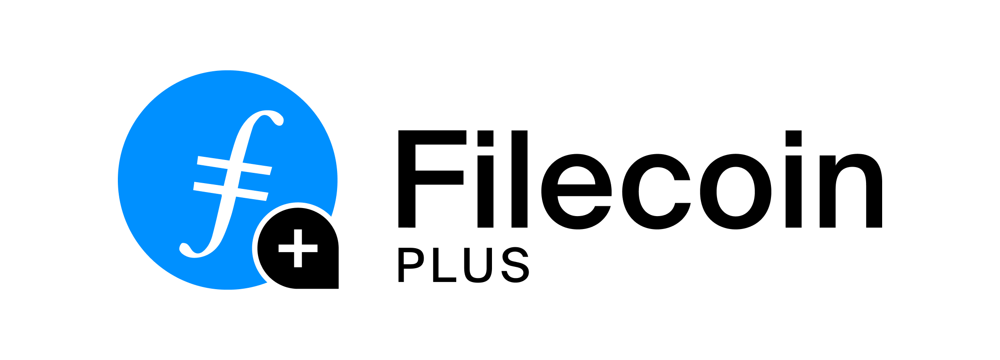

<p align="left">
  
</p>

## Introduction
Filecoin Plus aims to maximize the amount of useful storage on Filecoin by adding a layer of social trust to the Network. [Clients](#client) can apply to [Notaries](#notary) to receive [DataCap](#datacap), which can be used to incentivize Miners to take storage deals. Miners who take deals that are compensated with DataCap receive a 10x to their quality adjusted power - increasing their probability of winning block rewards. Filecoin Plus puts power in the hands of Clients and incentivizes Miners to support real use case on the Network.

## Using DataCap
### How to Get DataCap
Clients can get DataCap by making a request to a Notary - you can find a list of active Notaries on the [Filecoin Plus Registry](https://filecoinplus.on.fleek.co). Notaries may specialize in the types of requests they’ll choose to support - some may hand out small amounts of DataCap freely, while others may support larger requests (but may also require more due diligence).

At a minimum, every Notary will require an on-chain Filecoin address to which they can send the requested DataCap. A Client can initialize their address on-chain by sending a minimal amount of Filecoin to it, e.g. as a result of purchasing some FIL from an exchange. As a Client makes deals using DataCap, the balance of DataCap on that address will be depleted. Filecoin addresses can only receive a single DataCap allocation. 

_Note: If you receive a DataCap allocation and require more, you should make a new request with a new address that you have initialized like above._

### How to Spend DataCap
Once you have an address with DataCap, you can make deals using DataCap as a part of the payment. Because miners receive a deal quality multiplier for taking FIL+ deals, many miners offer special pricing and services to attract Clients who use DataCap to make deals.

By default, when you make a deal with an address that has DataCap allocated, you will spend DataCap when making the deal. 

If making deals through the [API](https://github.com/filecoin-project/lotus/blob/master/documentation/en/api-methods.md#ClientStartDeal), make sure when calling `ClientStartDeal` that the `VerifiedDeal` parameter is set to `true`. 

If making deals from the command line, make sure to pass the flag `--verified-deal=true` as a parameter.

```
 lotus client deal --verified-deal=true
```

### Checking Remaining DataCap 
Once you have received DataCap to an address, you can check the remaining balance either by visiting a site that enables this (e.g. [verify.glif.io](https://verify.glif.io/)) or by querying your address on a node. 

#### With lotus v1.10.0 ^

```
lotus filplus check-client-datacap f00000
```

#### With lotus v1.9.0 and below
_Note: [Lotus-shed](https://github.com/filecoin-project/lotus/tree/master/cmd/lotus-shed) is a separate package you will need to build and install (`make lotus-shed` in the [Lotus](https://github.com/filecoin-project/lotus) source), although these features are slated to be merged into Lotus._

```
lotus-shed verifreg check-client f00000
```

### Finding Miners to Take FIL+ Deals
There are a few difference ways in which a client can find a miner to take a FIL+ storage deal:
- This [issue](https://github.com/filecoin-project/notary-governance/issues/8) has a list of miners involved in the discussion below that advertise details about their services
- Join the [#fil-plus](https://filecoinproject.slack.com/archives/C01DLAPKDGX) channel on Filecoin Slack to discuss storage options
- Hop into the network with your node and query miners (using `query-ask`) to check their verified deal prices

### Best Practices
As a client who has received DataCap for making storage deals on Filecoin, this [issue](https://github.com/filecoin-project/notary-governance/issues/9) is a great starting point. A few of the key thoughts shared in the issue include: 

- Store multiple copies of data across different data centers, and perhaps even regions, to ensure your data is reliably stored
- Distribute your storage deals across different miners so your data is more likely to be accessible long term
- Ask for features (like `fast retrieval`) that would make your experience better
- Stay in compliance with Miners’ stated Terms of Service and Content Policy

## Terminology
### DataCap
DataCap, when allocated to a Client, can be spent by the Client in storage deals with miners. These deals carry a higher deal quality multiplier, which increases the “quality adjusted power” of the storage miner on the network (yielding better block rewards for the miner over time). In short, miners are heavily incentivized to take deals from Clients who use DataCap to pay for their deals. 

DataCap is granted in batches to Notaries, who in turn, allocate it to responsible clients that spend the DataCap to fund storage deals. DataCap is consumed as it is used to make deals. 

### Notary
Notaries are selected to serve as fiduciaries for the Filecoin Network, and are responsible for allocating DataCap to clients with legitimate storage use cases. The base responsibilities of notaries include: 
- Allocate DataCap to clients in order to subsidize reliable and useful storage on the network.
- Verify that Clients receive a DataCap commensurate with the level of trust that is warranted based on information provided.
- Ensure that in the allocation of the DataCap no party is given excessive trust in any form that might jeopardize the network.
- Follow operational guidelines, keep record of decision flow, and respond to any requests for audits of their allocation decisions.

You can find a list of the active Notaries [here](https://plus.fil.org) who can allocate DataCap. 

Notaries are selected through an application process described [here](https://github.com/filecoin-project/notary-governance/tree/main/notaries#application--selection-process). If approved, [Root Key Holders](https://github.com/filecoin-project/notary-governance/tree/main/root-key-holders#overview) (executors of the decisions made by the community on-chain) grant Notary status and associated DataCap amounts. Those interested in becoming Notaries should apply to this role by filing an Issue in the [Notary Governance Repo](https://github.com/filecoin-project/notary-governance/).

Notaries are given autonomy in their decision making process and encouraged to allocate DataCap based on their best judgement. However, Notaries should expect to answer any potential questions about previous allocation decisions before receiving future DataCap to distribute. 

Additionally, to prevent conflicts of interest, Notaries should not allocate DataCap to clients over which they control the private keys. In the event this is an issue, the Notary should contact another Notary (in the same geography or aligned to the same use case) to handle the allocation for that specific client.

_See additional information [here](https://github.com/filecoin-project/notary-governance/tree/main/notaries#overview)._

### Client
Clients are active participants of the network with DataCap allocation for their use cases. Clients can use their DataCap to incentivize miners to provide additional features and levels of services that meet their specific requirements. In doing so, storage related goods and services on Filecoin are made more valuable and competitive over time. Clients are vetted by Notaries to ensure the client receives DataCap commensurate with their reputation and needs, and that the Client responsibly allocates that DataCap. Obtain verification and DataCap allocation from a Notary. Deploy DataCap responsibly in accordance with the Principles. Follow operational guidelines, keep record of decision flow, and respond to any requests for audits of their allocation decisions.

Specific details on the suggested framework for responsible DataCap allocation are described in the [repository](https://github.com/filecoin-project/notary-governance). It is expected that clients who intend to receive greater amounts of DataCap may be asked to provide evidence for responsible spending of their previous allocation before receiving more.


## Resources
FIP introducing Filecoin Plus:
https://github.com/filecoin-project/FIPs/blob/master/FIPS/fip-0003.md

Notary Governance Repo (includes links to bi-weekly Governance Calls):
https://github.com/filecoin-project/notary-governance
